# NBE1_1_Team7
Programmers DevCourse BE 1기 7팀 1차 팀 프로젝트

## 0️⃣ 프로젝트 소개

### 프로젝트 명칭
로컬 카페 **Grids & Circles**

### 1차 프로젝트 참고 자료
- [1차 프로젝트](https://www.notion.so/1-3953906e07df4359ac6110d5f5199bef)

### 개발 기간
**2024/09/06 ~ 2024/09/12**

## 1️⃣ 기획서
- [1차 팀 프로젝트 기획서](https://www.notion.so/1-f52a96adbed24df6b55e350170e24bad)

## 2️⃣ 개발 툴
| Software | 세부 Spec 사양 (Version) |
| --- | --- |
| Java | Java SE 17.0.11 |
| Spring Boot | 3.3.3 |
| Spring Boot Libraries | Data JPA, Web, Validation, Security: 2.1.0 |
| Lombok | 1.18.20 |
| QueryDSL | JPA: 5.0.0 |
| Swagger/OpenAPI | SpringDoc OpenAPI MVC UI: 2.1.0 |
| MySQL | MySQL Community 8.0.39 |
| MySQL Connector | 8.0.29 |
| H2 Database | 2.1.214 (Test 용도) |
| JUnit | JUnit Platform Launcher: 1.9.2 |

## 3️⃣ 프로젝트 협업 규칙 
- [브랜치, 풀리퀘스트 전략](docs/Branch%20strategy%20and%20pull-quest.md)
- [코드 컨벤션](https://www.notion.so/Code-Convention-39b695d898124b9c9d92214b83d84fc8)
- [커밋 컨벤션](docs/Define%20a%20commit%20message%20convention.md)

## 4️⃣ 프로젝트 구현

### 1. **주요 기능 요약**:
   - **회원 관리**: 회원가입, 로그인/로그아웃, 개인 정보 조회 및 수정
   - **관리자**: 상품, 배송, FAQ 관리
   - **사용자**: 상품 주문, 조회, 검색, 장바구니, 리뷰
   
### 2. **데이터베이스 연동**:
   - **MySQL**: 실제 운영 데이터베이스로 사용. 회원, 주문, 상품, 장바구니, 리뷰, FAQ 데이터을 저장.
   - **H2 Database**: 테스트 용도로 사용. 개발 및 테스트 환경에서 사용.

### 3. **Spring Security**:
   - **간단한 인증 및 인가 구현**: API 보호를 위한 기본적인 인증 로직 사용.

### 4. **테스트**:
   - **JUnit을 이용한 유닛 테스트**: 각 서비스 로직 및 컨트롤러에 대한 테스트 구현.

### 5. **Swagger API 문서화**:
   - SpringDoc을 활용하여 API 문서 자동 생성.
   - `/swagger-ui.html`에서 API 문서 확인 가능.

### 6. **Sequence Diagram**
- [Sequence Diagram](docs/Sequence%20Diagram.md)
#### 회원

##### 1. 회원가입

1. **사용자**는 아이디, 비밀번호, 이메일, 주소, 우편번호 입력
2. **웹 애플리케이션**에서 입력된 데이터를 검증
3. **웹 애플리케이션**에서 데이터를 **데이터베이스**에 저장
4. 회원가입 성공 메시지를 사용자에게 반환
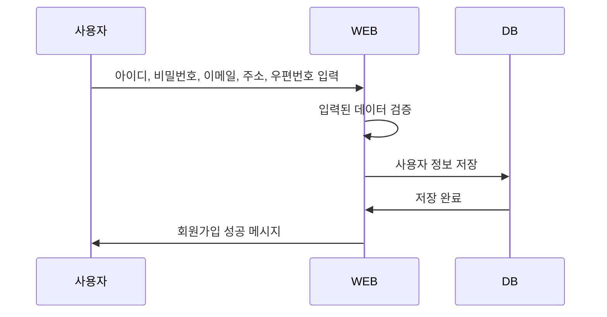
```mermaid
sequenceDiagram
		participant User as 사용자
		participant WebApp as WEB
		participant DB as DB
		
		User ->> WebApp: 아이디, 비밀번호, 이메일, 주소, 우편번호 입력
		WebApp ->> WebApp: 입력된 데이터 검증
		WebApp ->> DB: 사용자 정보 저장
		DB ->> WebApp: 저장 완료
		WebApp ->> User: 회원가입 성공 메시지
```
##### 2. 로그인, 로그아웃

1. **사용자**는 아이디와 비밀번호를 입력하고 로그인 요청을 보냄
2. **웹 애플리케이션**은 아이디와 비밀번호의 유효성을 검증함
3. 유효하면 **데이터베이스**에서 사용자의 정보 조회 후, 일치하는 경우 세션을 생성함
4. 로그인 성공 메시지를 사용자에게 반환함
5. 세션이 일정 시간이 지나면 만료됨
6. 세션 만료 시, 자동 로그아웃 처리됨
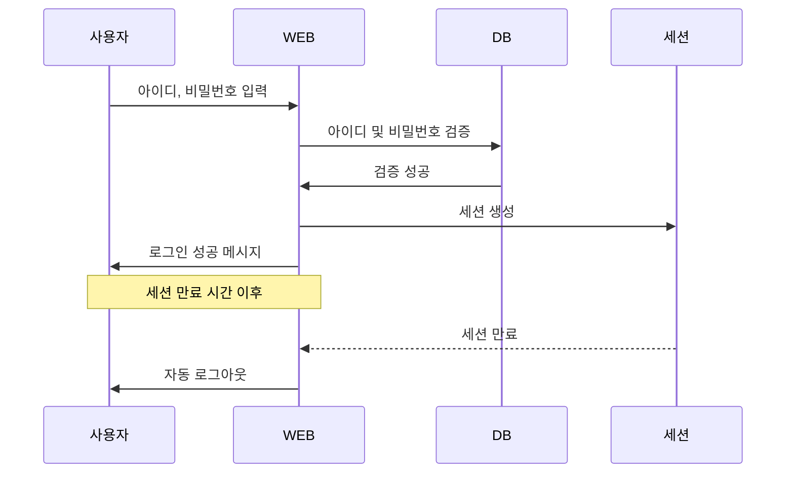
```mermaid
sequenceDiagram
    participant User as 사용자
    participant WebApp as WEB
    participant DB as DB
    participant Session as 세션
    
    User ->> WebApp: 아이디, 비밀번호 입력
    WebApp ->> DB: 아이디 및 비밀번호 검증
    DB ->> WebApp: 검증 성공
    WebApp ->> Session: 세션 생성
    WebApp ->> User: 로그인 성공 메시지
    
    Note over WebApp, User: 세션 만료 시간 이후
    
    Session -->> WebApp: 세션 만료
    WebApp ->> User: 자동 로그아웃
```

##### 3. 회원 정보 관리

- **개인정보 조회**
1. **사용자**는 개인정보 조회 요청을 보냄
2. **웹 애플리케이션**은 사용자의 인증 상태를 확인함
3. 인증된 경우, **데이터베이스**에서 사용자 정보를 조회함
4. 사용자 정보(아이디, 이메일, 주소, 우편번호 등)를 반환함

- **개인정보 수정**
1. **사용자**는 개인정보 수정 요청을 보냄
2. **웹 애플리케이션**은 사용자의 인증 상태를 확인함
3. **사용자**는 새로운 비밀번호를 입력함
4. **웹 애플리케이션**은 새로운 비밀번호의 유효성을 검증함
5. 검증이 통과하면 **데이터베이스**에 비밀번호를 업데이트함
6. 개인정보 수정 성공 메시지를 반환함
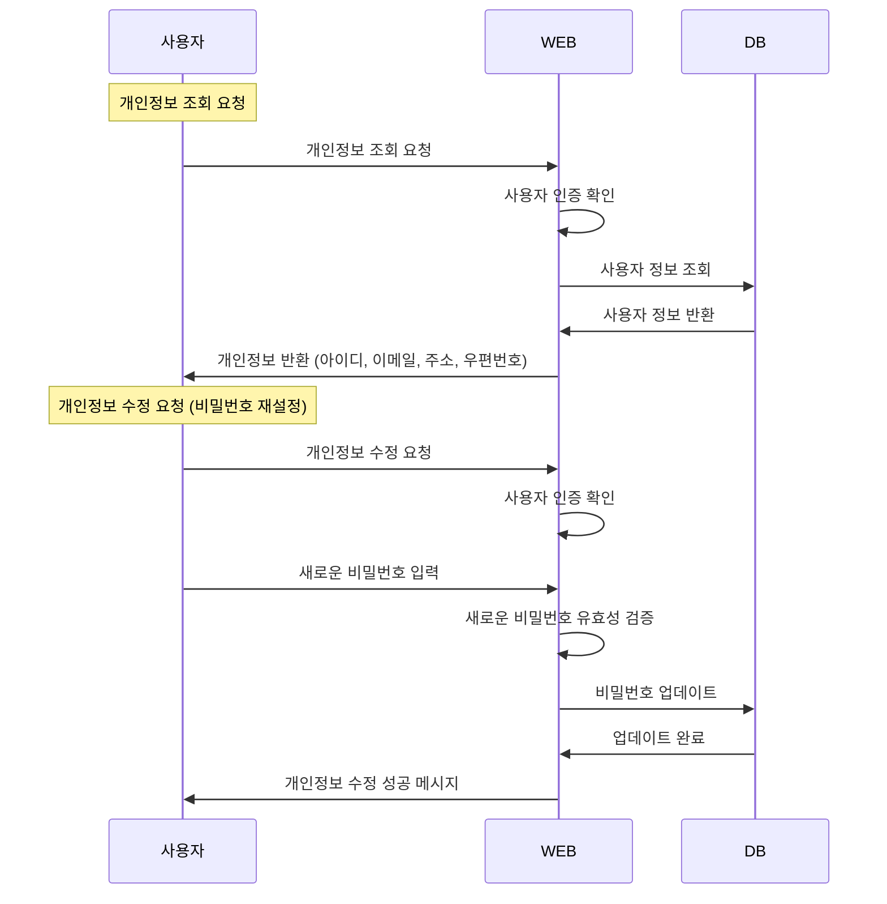
```mermaid
sequenceDiagram
    participant User as 사용자
    participant WebApp as WEB
    participant DB as DB

    Note over User: 개인정보 조회 요청
    User ->> WebApp: 개인정보 조회 요청
    WebApp ->> WebApp: 사용자 인증 확인
    WebApp ->> DB: 사용자 정보 조회
    DB ->> WebApp: 사용자 정보 반환
    WebApp ->> User: 개인정보 반환 (아이디, 이메일, 주소, 우편번호)

    Note over User: 개인정보 수정 요청 (비밀번호 재설정)
    User ->> WebApp: 개인정보 수정 요청
    WebApp ->> WebApp: 사용자 인증 확인
    User ->> WebApp: 새로운 비밀번호 입력
    WebApp ->> WebApp: 새로운 비밀번호 유효성 검증
    WebApp ->> DB: 비밀번호 업데이트
    DB ->> WebApp: 업데이트 완료
    WebApp ->> User: 개인정보 수정 성공 메시지
```
#### 상품

##### 4. 상품 등록, 수정, 삭제

- **상품 등록**
1. **관리자**가 상품명, 가격, 상품 상세정보를 입력함
2. **웹 애플리케이션**에서 입력 정보의 유효성을 검증 후, **데이터베이스**에 상품 정보 저장
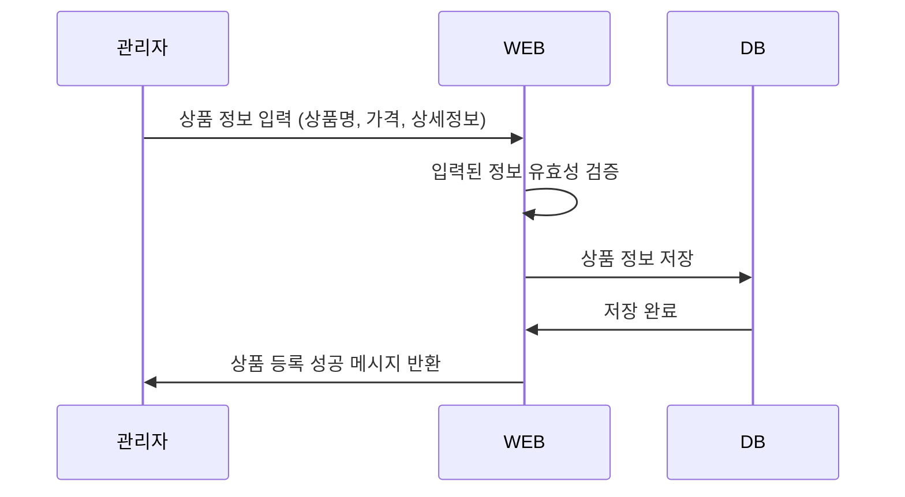
```mermaid
sequenceDiagram
    participant Admin as 관리자
    participant WebApp as WEB
    participant DB as DB

    Admin ->> WebApp: 상품 정보 입력 (상품명, 가격, 상세정보)
    WebApp ->> WebApp: 입력된 정보 유효성 검증
    WebApp ->> DB: 상품 정보 저장
    DB ->> WebApp: 저장 완료
    WebApp ->> Admin: 상품 등록 성공 메시지 반환
```
- **상품 수정**
1. **관리자**가 수정할 상품의 ID와 수정할 정보를 입력함 (상품명, 가격, 상품 상세정보)
2. **웹 애플리케이션**에서 이를 검증 후 **데이터베이스**에 업데이트함.
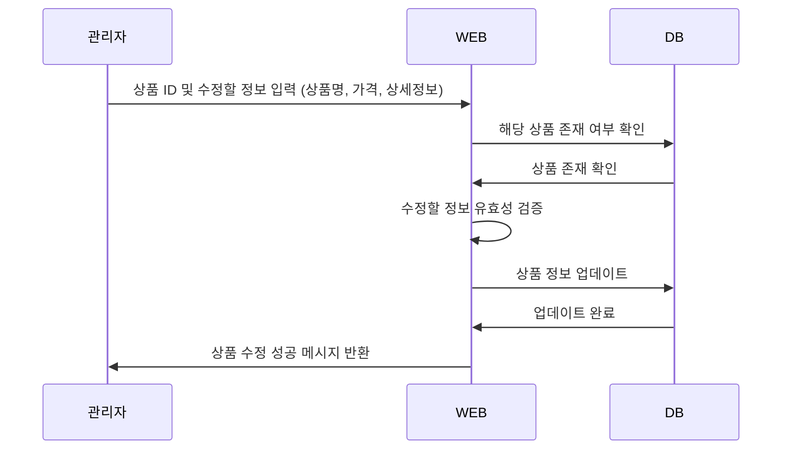
```mermaid
sequenceDiagram
    participant Admin as 관리자
    participant WebApp as WEB
    participant DB as DB

    Admin ->> WebApp: 상품 ID 및 수정할 정보 입력 (상품명, 가격, 상세정보)
    WebApp ->> DB: 해당 상품 존재 여부 확인
    DB ->> WebApp: 상품 존재 확인
    WebApp ->> WebApp: 수정할 정보 유효성 검증
    WebApp ->> DB: 상품 정보 업데이트
    DB ->> WebApp: 업데이트 완료
    WebApp ->> Admin: 상품 수정 성공 메시지 반환
```
- **상품 삭제**
1. **관리자**가 삭제할 상품의 ID를 입력함.
2. **웹 애플리케이션**은 상품을 **데이터베이스**에서 삭제함.
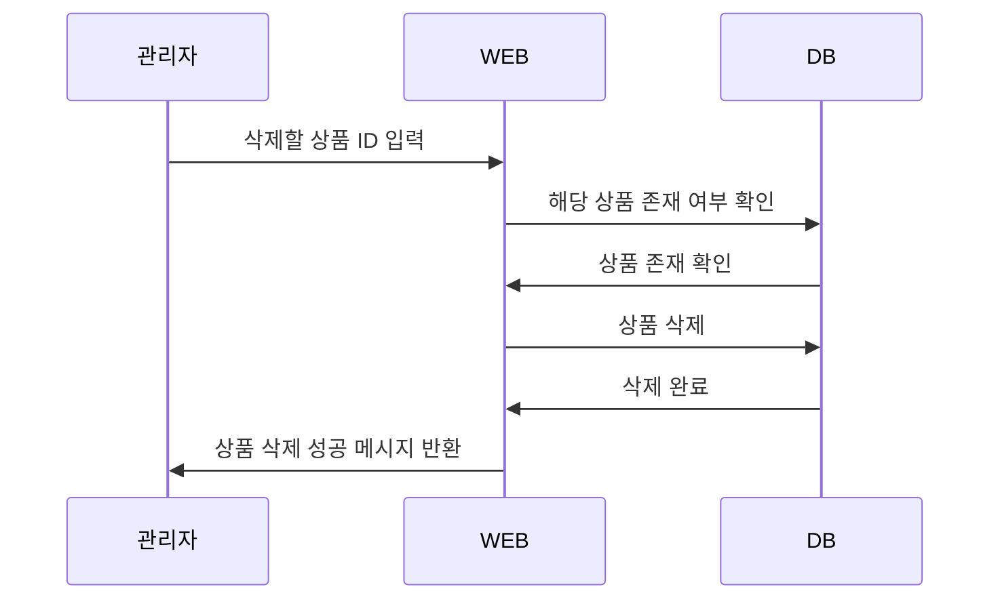
```mermaid
sequenceDiagram
    participant Admin as 관리자
    participant WebApp as WEB
    participant DB as DB

    Admin ->> WebApp: 삭제할 상품 ID 입력
    WebApp ->> DB: 해당 상품 존재 여부 확인
    DB ->> WebApp: 상품 존재 확인
    WebApp ->> DB: 상품 삭제
    DB ->> WebApp: 삭제 완료
    WebApp ->> Admin: 상품 삭제 성공 메시지 반환
```
##### 5. 상품 정보 조회 및 검색

1. **사용자**는 상품 목록을 조회함
2. **웹 애플리케이션**은 **데이터베이스**에서 모든 상품 정보를 조회하여 반환함
3. **사용자**는 특정 상품의 세부 정보를 조회할 수 있음
4. **사용자**는 등록된 상품을 검색하거나 필터링할 수 있음 (카테고리, 가격, 판매량, 이름, 평점 등)
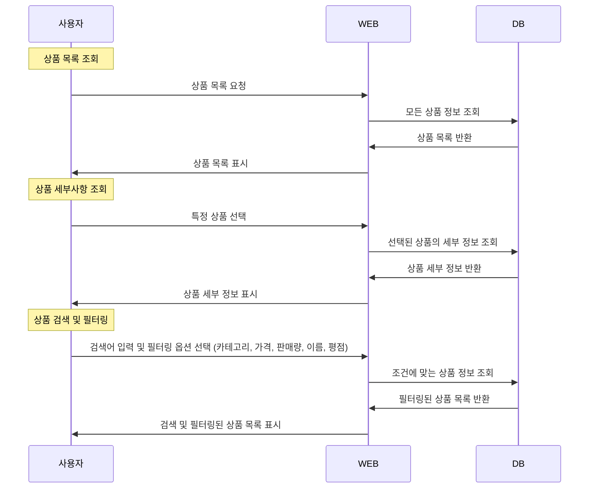
```mermaid
sequenceDiagram
    participant User as 사용자
    participant WebApp as WEB
    participant DB as DB

    Note over User: 상품 목록 조회
    User ->> WebApp: 상품 목록 요청
    WebApp ->> DB: 모든 상품 정보 조회
    DB ->> WebApp: 상품 목록 반환
    WebApp ->> User: 상품 목록 표시

    Note over User: 상품 세부사항 조회
    User ->> WebApp: 특정 상품 선택
    WebApp ->> DB: 선택된 상품의 세부 정보 조회
    DB ->> WebApp: 상품 세부 정보 반환
    WebApp ->> User: 상품 세부 정보 표시

    Note over User: 상품 검색 및 필터링
    User ->> WebApp: 검색어 입력 및 필터링 옵션 선택 (카테고리, 가격, 판매량, 이름, 평점)
    WebApp ->> DB: 조건에 맞는 상품 정보 조회
    DB ->> WebApp: 필터링된 상품 목록 반환
    WebApp ->> User: 검색 및 필터링된 상품 목록 표시
```
##### 6. 상품 리뷰 작성, 수정

- **상품 리뷰 작성**
1. **사용자**는 상품에 대해 평점과 함께 리뷰를 작성함
2. **웹 애플리케이션**은 사용자가 해당 상품에 이미 리뷰를 작성했는지 **데이터베이스**에서 확인함
3. 리뷰가 존재하지 않으면, 리뷰를 **데이터베이스**에 저장함
4. 리뷰 작성 성공 메시지를 반환함

- **상품 리뷰 수정**
1. **사용자**는 자신이 작성한 리뷰를 수정 요청함
2. **웹 애플리케이션**은 사용자가 해당 상품에 작성한 리뷰가 있는지 **데이터베이스**에서 확인함
3. 리뷰가 존재하고 본인의 리뷰일 경우, 수정할 내용을 입력함
4. **웹 애플리케이션**은 수정된 리뷰를 **데이터베이스**에 업데이트함
5. 리뷰 수정 성공 메시지를 반환함
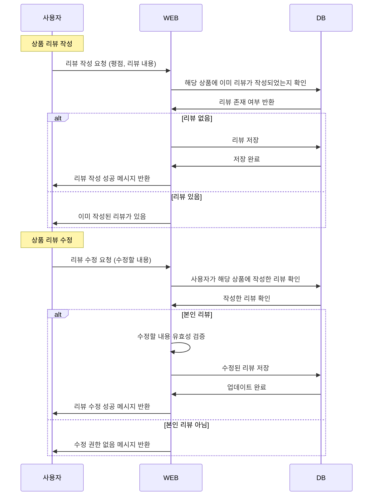
```mermaid
sequenceDiagram
    participant User as 사용자
    participant WebApp as WEB
    participant DB as DB

    Note over User: 상품 리뷰 작성
    User ->> WebApp: 리뷰 작성 요청 (평점, 리뷰 내용)
    WebApp ->> DB: 해당 상품에 이미 리뷰가 작성되었는지 확인
    DB ->> WebApp: 리뷰 존재 여부 반환
    alt 리뷰 없음
        WebApp ->> DB: 리뷰 저장
        DB ->> WebApp: 저장 완료
        WebApp ->> User: 리뷰 작성 성공 메시지 반환
    else 리뷰 있음
        WebApp ->> User: 이미 작성된 리뷰가 있음
    end

    Note over User: 상품 리뷰 수정
    User ->> WebApp: 리뷰 수정 요청 (수정할 내용)
    WebApp ->> DB: 사용자가 해당 상품에 작성한 리뷰 확인
    DB ->> WebApp: 작성한 리뷰 확인
    alt 본인 리뷰
        WebApp ->> WebApp: 수정할 내용 유효성 검증
        WebApp ->> DB: 수정된 리뷰 저장
        DB ->> WebApp: 업데이트 완료
        WebApp ->> User: 리뷰 수정 성공 메시지 반환
    else 본인 리뷰 아님
        WebApp ->> User: 수정 권한 없음 메시지 반환
    end
```
##### 7. 상품 할인

1. **관리자**는 개별 상품 또는 카테고리별로 할인을 적용함
2. **웹 애플리케이션**은 할인 대상(개별 상품 또는 카테고리)을 선택하고, 할인율을 입력함
3. **웹 애플리케이션**은 할인 정보를 **데이터베이스**에 저장함
4. 할인이 적용된 상품에 대한 성공 메시지를 반환함
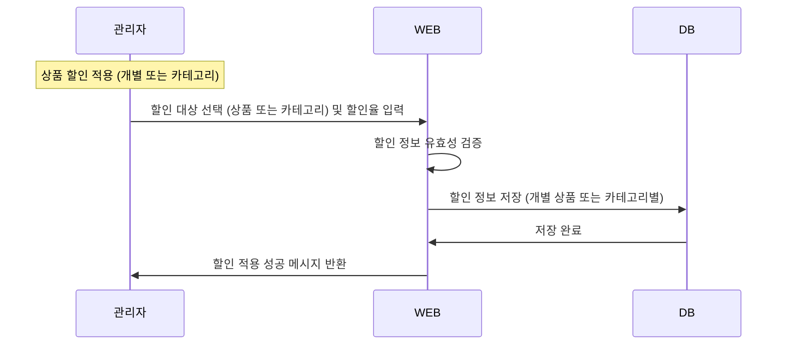
```mermaid
sequenceDiagram
    participant Admin as 관리자
    participant WebApp as WEB
    participant DB as DB

    Note over Admin: 상품 할인 적용 (개별 또는 카테고리)
    Admin ->> WebApp: 할인 대상 선택 (상품 또는 카테고리) 및 할인율 입력
    WebApp ->> WebApp: 할인 정보 유효성 검증
    WebApp ->> DB: 할인 정보 저장 (개별 상품 또는 카테고리별)
    DB ->> WebApp: 저장 완료
    WebApp ->> Admin: 할인 적용 성공 메시지 반환
```
##### 8. 인기 상품

1. **사용자**는 인기 상품 목록을 조회함
2. **웹 애플리케이션**은 **데이터베이스**에서 판매량 기준으로 정렬된 상품 목록을 조회함
3. 상위 몇 개의 상품을 인기 상품으로 선택함
4. 인기 상품 목록을 사용자에게 반환함
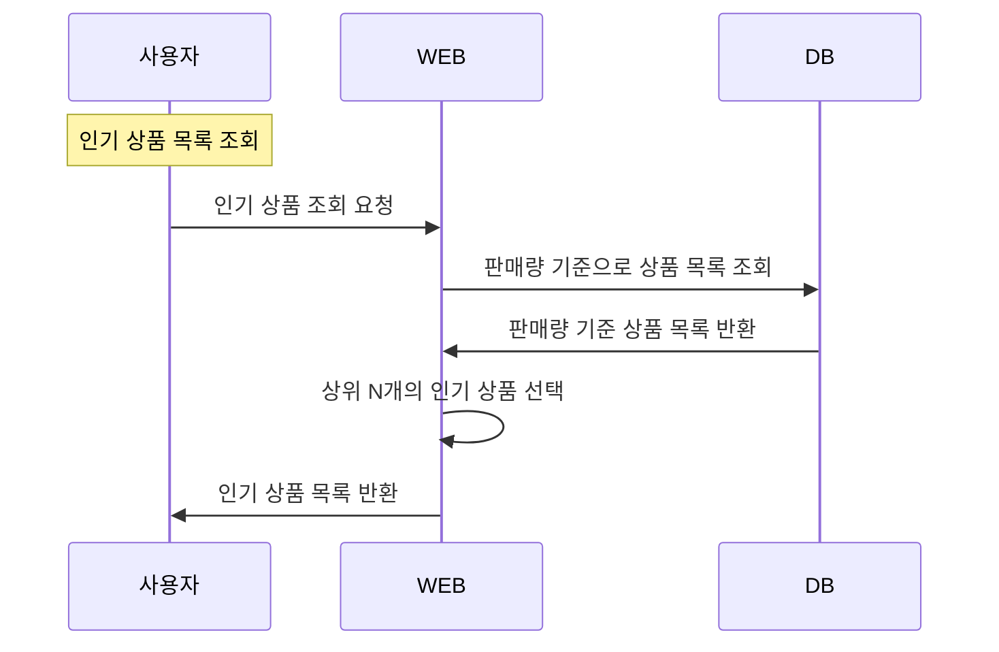
```mermaid
sequenceDiagram
    participant User as 사용자
    participant WebApp as WEB
    participant DB as DB

    Note over User: 인기 상품 목록 조회
    User ->> WebApp: 인기 상품 조회 요청
    WebApp ->> DB: 판매량 기준으로 상품 목록 조회
    DB ->> WebApp: 판매량 기준 상품 목록 반환
    WebApp ->> WebApp: 상위 N개의 인기 상품 선택
    WebApp ->> User: 인기 상품 목록 반환
```
##### 9. 장바구니 추가, 수정, 삭제

- **장바구니 추가**
1. **사용자**는 장바구니에 상품과 그 수량을 추가함
2. **웹 애플리케이션**은 선택된 상품이 이미 장바구니에 있는지 확인함
3. 없으면 **데이터베이스**에 해당 상품과 수량을 저장함
4. 장바구니 추가 성공 메시지를 반환함
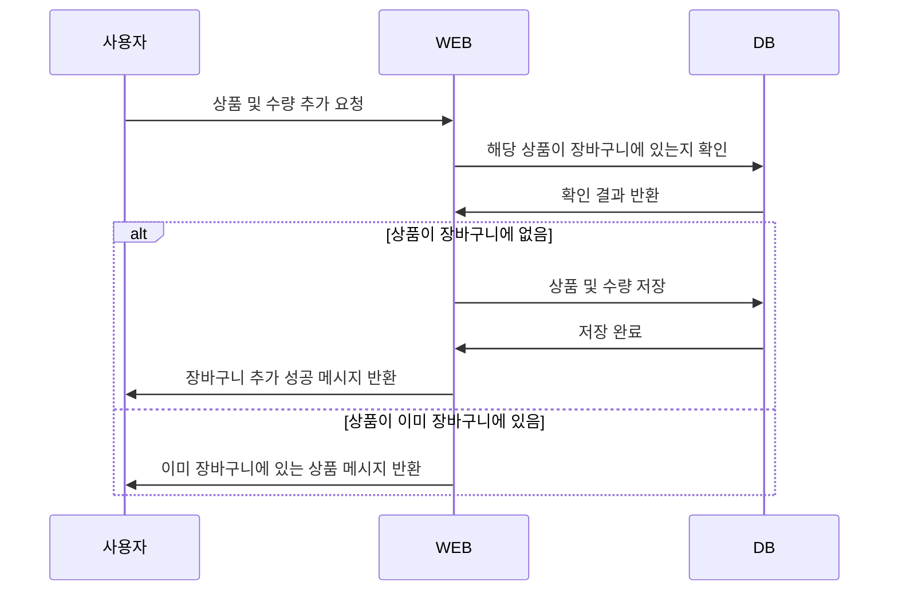
```mermaid
sequenceDiagram
    participant User as 사용자
    participant WebApp as WEB
    participant DB as DB

    User ->> WebApp: 상품 및 수량 추가 요청
    WebApp ->> DB: 해당 상품이 장바구니에 있는지 확인
    DB ->> WebApp: 확인 결과 반환
    alt 상품이 장바구니에 없음
        WebApp ->> DB: 상품 및 수량 저장
        DB ->> WebApp: 저장 완료
        WebApp ->> User: 장바구니 추가 성공 메시지 반환
    else 상품이 이미 장바구니에 있음
        WebApp ->> User: 이미 장바구니에 있는 상품 메시지 반환
    end
```
- **장바구니 수정**
1. **사용자**는 장바구니에 있는 상품의 종류나 수량을 수정함
2. **웹 애플리케이션**은 수정할 상품이 장바구니에 있는지 확인함
3. 있으면 수정된 수량을 **데이터베이스**에 업데이트함
4. 장바구니 수정 성공 메시지를 반환함
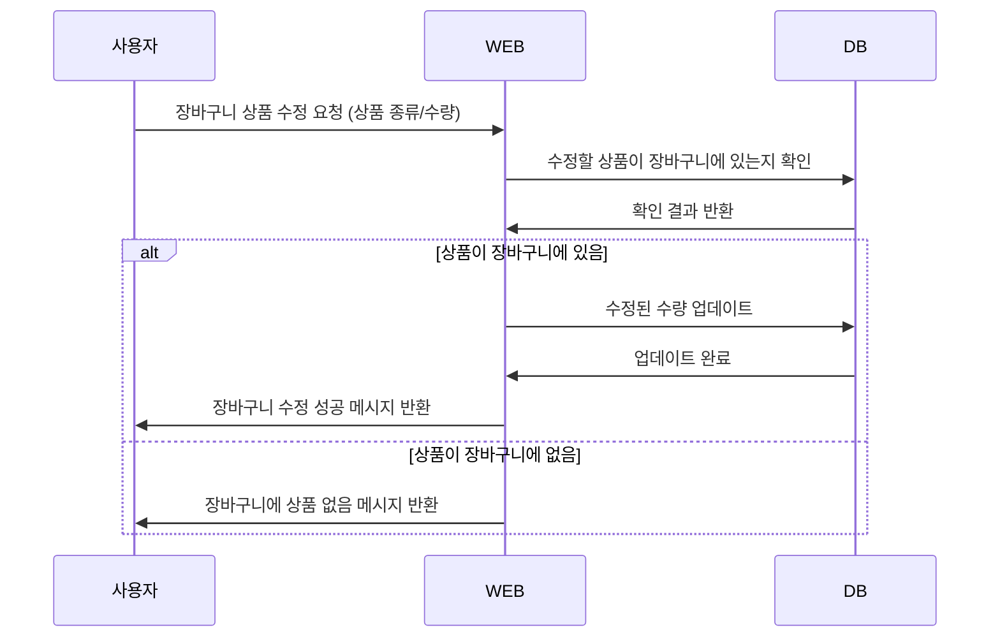
```mermaid
sequenceDiagram
    participant User as 사용자
    participant WebApp as WEB
    participant DB as DB

    User ->> WebApp: 장바구니 상품 수정 요청 (상품 종류/수량)
    WebApp ->> DB: 수정할 상품이 장바구니에 있는지 확인
    DB ->> WebApp: 확인 결과 반환
    alt 상품이 장바구니에 있음
        WebApp ->> DB: 수정된 수량 업데이트
        DB ->> WebApp: 업데이트 완료
        WebApp ->> User: 장바구니 수정 성공 메시지 반환
    else 상품이 장바구니에 없음
        WebApp ->> User: 장바구니에 상품 없음 메시지 반환
    end
```
- 장바구니 삭제
1. **사용자**는 장바구니에서 특정 상품을 삭제함
2. **웹 애플리케이션**은 삭제할 상품이 장바구니에 있는지 확인함
3. 있으면 **데이터베이스**에서 해당 상품을 삭제함
4. 또는 상품이 주문 완료되면 자동으로 장바구니에서 삭제됨
5. 장바구니 삭제 성공 메시지를 반환함
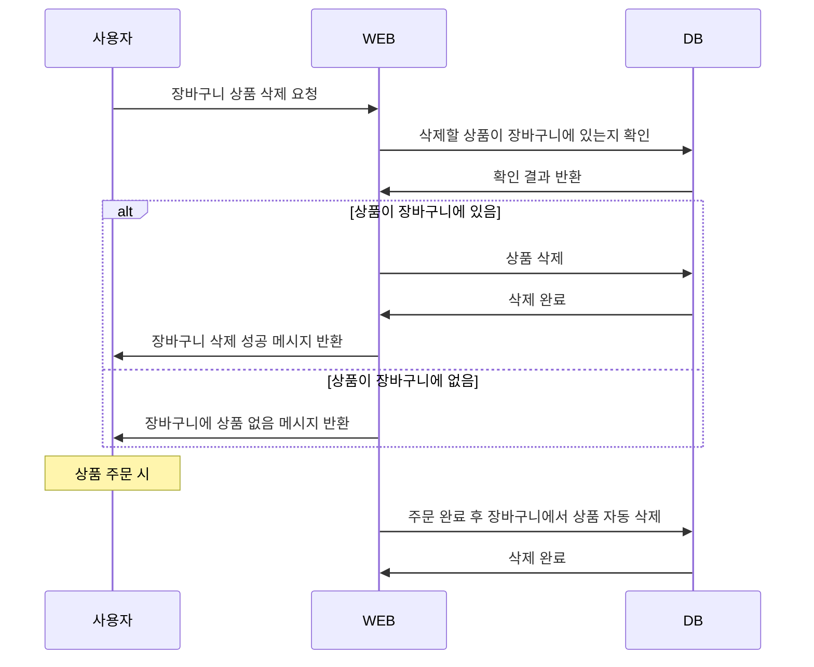
```mermaid
sequenceDiagram
    participant User as 사용자
    participant WebApp as WEB
    participant DB as DB

    User ->> WebApp: 장바구니 상품 삭제 요청
    WebApp ->> DB: 삭제할 상품이 장바구니에 있는지 확인
    DB ->> WebApp: 확인 결과 반환
    alt 상품이 장바구니에 있음
        WebApp ->> DB: 상품 삭제
        DB ->> WebApp: 삭제 완료
        WebApp ->> User: 장바구니 삭제 성공 메시지 반환
    else 상품이 장바구니에 없음
        WebApp ->> User: 장바구니에 상품 없음 메시지 반환
    end

    Note over User: 상품 주문 시
    WebApp ->> DB: 주문 완료 후 장바구니에서 상품 자동 삭제
    DB ->> WebApp: 삭제 완료
```
#### 주문

##### 10. 주문하기

1. **사용자**는 상품 목록에서 상품을 선택하고, 상품명과 상품 수량을 입력하여 주문 요청을 보냄
2. **웹 애플리케이션**은 주문 정보의 유효성을 검증함 (재고 확인 등)
3. 주문이 유효하면 **데이터베이스**에 주문 정보를 저장함
4. 주문 성공 메시지를 사용자에게 반환함
5. 주문된 상품은 장바구니에서 자동으로 삭제됨
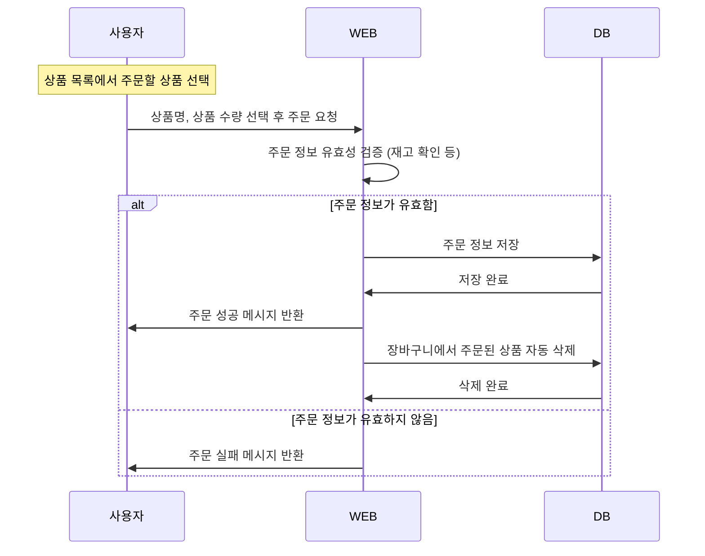
```mermaid
sequenceDiagram
    participant User as 사용자
    participant WebApp as WEB
    participant DB as DB

    Note over User: 상품 목록에서 주문할 상품 선택
    User ->> WebApp: 상품명, 상품 수량 선택 후 주문 요청
    WebApp ->> WebApp: 주문 정보 유효성 검증 (재고 확인 등)
    alt 주문 정보가 유효함
        WebApp ->> DB: 주문 정보 저장
        DB ->> WebApp: 저장 완료
        WebApp ->> User: 주문 성공 메시지 반환
        WebApp ->> DB: 장바구니에서 주문된 상품 자동 삭제
        DB ->> WebApp: 삭제 완료
    else 주문 정보가 유효하지 않음
        WebApp ->> User: 주문 실패 메시지 반환
    end
```
##### 11. 주문 메뉴 수정

1. **사용자**는 기존 주문에서 메뉴를 추가, 삭제하거나 수량을 수정함
2. **웹 애플리케이션**은 수정된 주문 정보의 유효성을 검증함 (재고 확인 등)
3. 수정된 주문 정보를 **데이터베이스**에 업데이트함
4. 주문 수정 성공 메시지를 반환함
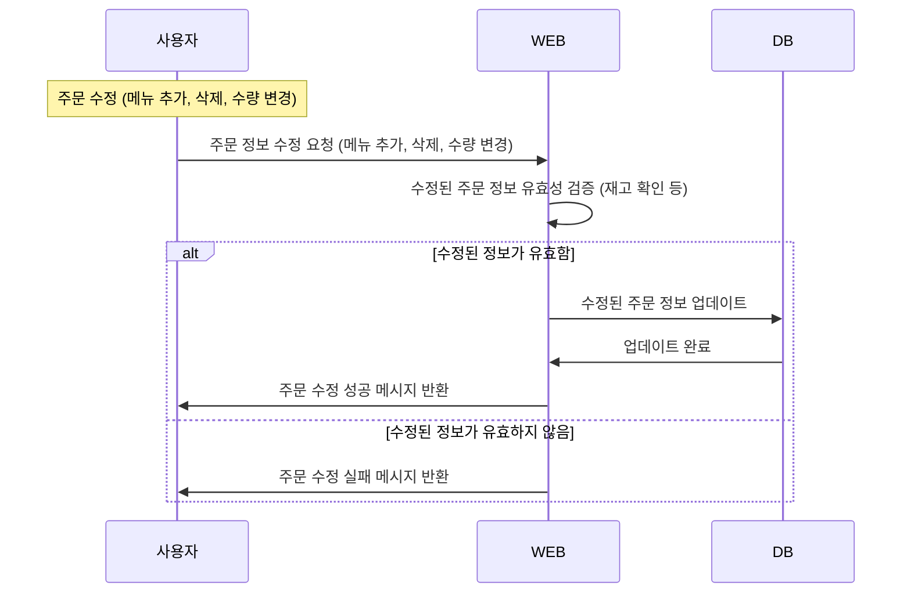
```mermaid
sequenceDiagram
    participant User as 사용자
    participant WebApp as WEB
    participant DB as DB

    Note over User: 주문 수정 (메뉴 추가, 삭제, 수량 변경)
    User ->> WebApp: 주문 정보 수정 요청 (메뉴 추가, 삭제, 수량 변경)
    WebApp ->> WebApp: 수정된 주문 정보 유효성 검증 (재고 확인 등)
    alt 수정된 정보가 유효함
        WebApp ->> DB: 수정된 주문 정보 업데이트
        DB ->> WebApp: 업데이트 완료
        WebApp ->> User: 주문 수정 성공 메시지 반환
    else 수정된 정보가 유효하지 않음
        WebApp ->> User: 주문 수정 실패 메시지 반환
    end
```
##### 12. 주문 사용자 정보 수정

1. **사용자**는 주문한 후 우편번호, 주소 등의 정보를 수정 요청함
2. **웹 애플리케이션**은 사용자가 해당 주문을 한 사람인지 확인함
3. 사용자 정보가 유효하면 **데이터베이스**에 수정된 정보를 업데이트함
4. 정보 수정 성공 메시지를 반환함
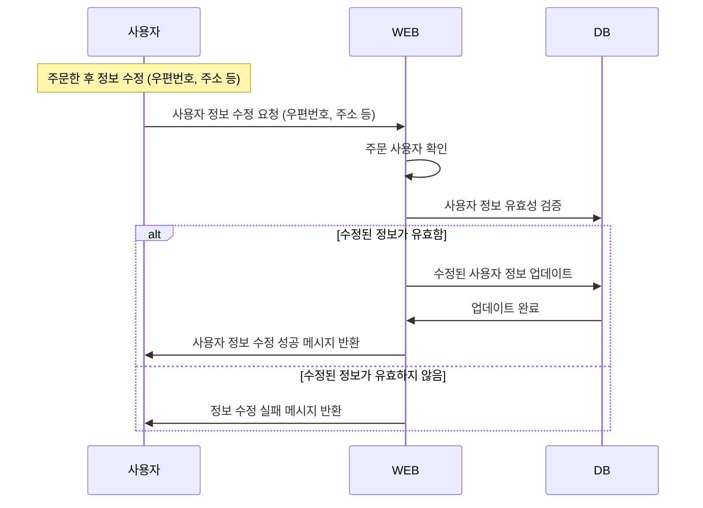
```mermaid
sequenceDiagram
    participant User as 사용자
    participant WebApp as WEB
    participant DB as DB

    Note over User: 주문한 후 정보 수정 (우편번호, 주소 등)
    User ->> WebApp: 사용자 정보 수정 요청 (우편번호, 주소 등)
    WebApp ->> WebApp: 주문 사용자 확인
    WebApp ->> DB: 사용자 정보 유효성 검증
    alt 수정된 정보가 유효함
        WebApp ->> DB: 수정된 사용자 정보 업데이트
        DB ->> WebApp: 업데이트 완료
        WebApp ->> User: 사용자 정보 수정 성공 메시지 반환
    else 수정된 정보가 유효하지 않음
        WebApp ->> User: 정보 수정 실패 메시지 반환
    end
```
##### 13. 주문 취소

1. **사용자**는 주문 취소 요청을 보냄
2. **웹 애플리케이션**은 해당 주문이 아직 배송되지 않았는지 확인함
3. 배송 전이면 **데이터베이스**에서 주문 정보를 취소 처리함
4. 주문 취소 성공 메시지를 반환함
5. 배송이 이미 진행된 경우, 주문 취소 불가 메시지를 반환함
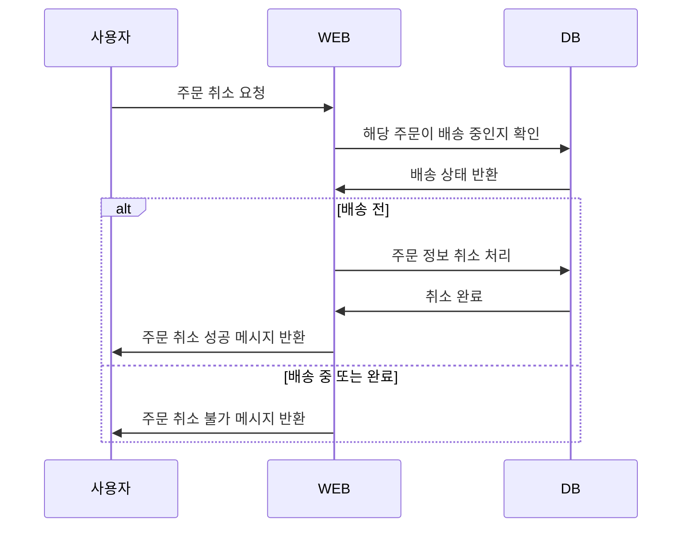
```mermaid
sequenceDiagram
    participant User as 사용자
    participant WebApp as WEB
    participant DB as DB

    User ->> WebApp: 주문 취소 요청
    WebApp ->> DB: 해당 주문이 배송 중인지 확인
    DB ->> WebApp: 배송 상태 반환
    alt 배송 전
        WebApp ->> DB: 주문 정보 취소 처리
        DB ->> WebApp: 취소 완료
        WebApp ->> User: 주문 취소 성공 메시지 반환
    else 배송 중 또는 완료
        WebApp ->> User: 주문 취소 불가 메시지 반환
    end
```
##### 14. 주문 목록 조회

1. **사용자**는 자신의 주문 내역을 조회 요청함
2. **웹 애플리케이션**은 **데이터베이스**에서 해당 사용자의 모든 주문 내역을 조회함
3. 조회된 주문 내역을 사용자에게 반환함
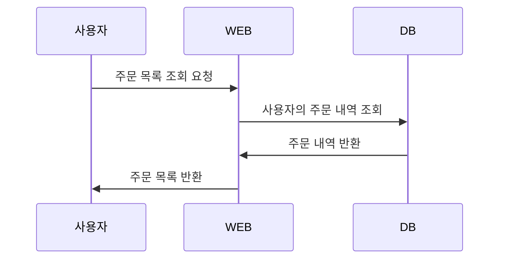
```mermaid
sequenceDiagram
    participant User as 사용자
    participant WebApp as WEB
    participant DB as DB

    User ->> WebApp: 주문 목록 조회 요청
    WebApp ->> DB: 사용자의 주문 내역 조회
    DB ->> WebApp: 주문 내역 반환
    WebApp ->> User: 주문 목록 반환
```
##### 15. 전체 주문 목록 조회

1. **관리자**는 전체 사용자에 대한 주문 목록 조회를 요청함
2. **웹 애플리케이션**은 **데이터베이스**에서 모든 사용자들의 주문 내역을 조회함
3. 조회된 주문 내역을 관리자에게 반환함
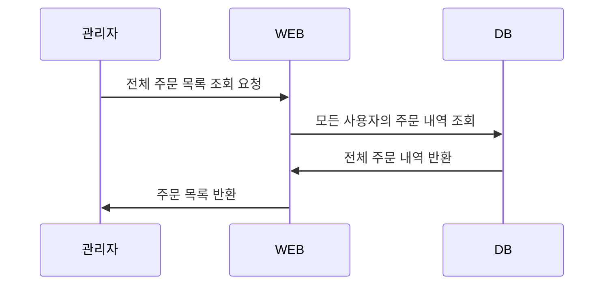
```mermaid
sequenceDiagram
    participant Admin as 관리자
    participant WebApp as WEB
    participant DB as DB

    Admin ->> WebApp: 전체 주문 목록 조회 요청
    WebApp ->> DB: 모든 사용자의 주문 내역 조회
    DB ->> WebApp: 전체 주문 내역 반환
    WebApp ->> Admin: 주문 목록 반환
```
##### 16. 배송 시작 일괄 처리

1. **관리자**는 전날 오후 2시부터 금일 오후 2시까지의 주문 목록 조회를 요청함
2. **웹 애플리케이션**은 **데이터베이스**에서 해당 시간 범위에 해당하는 주문 목록을 조회함
3. 조회된 주문들의 배송 상태를 ‘배송 시작’으로 일괄 변경함
4. 성공적으로 처리되었다는 메시지를 관리자에게 반환함
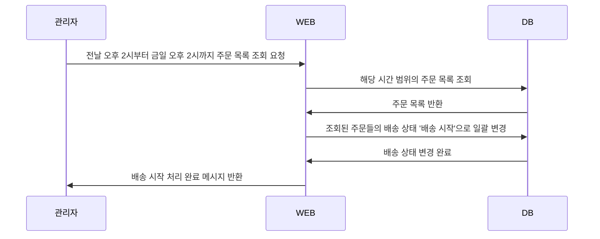
```mermaid
sequenceDiagram
    participant Admin as 관리자
    participant WebApp as WEB
    participant DB as DB

    Admin ->> WebApp: 전날 오후 2시부터 금일 오후 2시까지 주문 목록 조회 요청
    WebApp ->> DB: 해당 시간 범위의 주문 목록 조회
    DB ->> WebApp: 주문 목록 반환
    WebApp ->> DB: 조회된 주문들의 배송 상태 '배송 시작'으로 일괄 변경
    DB ->> WebApp: 배송 상태 변경 완료
    WebApp ->> Admin: 배송 시작 처리 완료 메시지 반환
```
##### 17. 포인트 적립

1. **사용자**는 상품을 주문함
2. **웹 애플리케이션**은 주문 금액의 2%를 계산하여 포인트로 적립함
3. **데이터베이스**에 적립된 포인트 정보를 업데이트함
4. 포인트 적립 성공 메시지를 사용자에게 반환함
```mermaid
sequenceDiagram
    participant User as 사용자
    participant WebApp as WEB
    participant DB as DB

    User ->> WebApp: 상품 주문
    WebApp ->> WebApp: 주문 금액의 2% 포인트 적립 계산
    WebApp ->> DB: 사용자 포인트 업데이트
    DB ->> WebApp: 업데이트 완료
    WebApp ->> User: 포인트 적립 성공 메시지 반환
```
#### FAQ

##### 18. FAQ 관리

1. **관리자**는 질문과 그에 대한 답변을 작성하여 FAQ 페이지에 등록 요청을 함
2. **웹 애플리케이션**은 질문과 답변을 검증함
3. 검증이 통과하면 **데이터베이스**에 FAQ 항목을 저장함
4. FAQ 등록 성공 메시지를 관리자에게 반환함
```mermaid
sequenceDiagram
    participant Admin as 관리자
    participant WebApp as WEB
    participant DB as DB

    Admin ->> WebApp: 질문과 답변 등록 요청
    WebApp ->> WebApp: 질문과 답변 유효성 검증
    alt 유효성 통과
        WebApp ->> DB: FAQ 항목 저장
        DB ->> WebApp: 저장 완료
        WebApp ->> Admin: FAQ 등록 성공 메시지 반환
    else 유효성 실패
        WebApp ->> Admin: FAQ 등록 실패 메시지 반환
    end
```

### 7. **ERD**


### 8. **프로젝트 패키지 구조**
```
com
└── grepp
    └── coffee
        └── backend
            ├── common
            │   └── exception
            │       ├── member
            │       │   ├── CartException.java
            │       │   └── MemberException.java
            │       ├── order
            │       │   └── OrderException.java
            │       ├── product
            │       │   └── ProductException.java
            │       ├── question
            │       │   └── QuestionException.java
            │       ├── review
            │       │   └── ReviewException.java
            │       ├── CoffeeException.java
            │       ├── ErrorResponse.java
            │       ├── ExceptionMessage.java
            │       └── GlobalExceptionHandler.java
            ├── config
            │   ├── QueryDslConfig.java
            │   └── SecurityConfig.java
            ├── controller
            │   ├── member
            │   │   ├── request
            │   │   │   ├── CartRegisterRequest.java
            │   │   │   ├── CartUpdateRequest.java
            │   │   │   ├── MemberLoginRequest.java
            │   │   │   ├── MemberRegisterRequest.java
            │   │   │   └── MemberUpdateRequest.java
            │   │   ├── CartController.java
            │   │   └── MemberController.java
            │   ├── order
            │   │   ├── request
            │   │   │   ├── OrderRegisterRequest.java
            │   │   │   └── OrderUpdateRequest.java
            │   │   └── OrderController.java
            │   ├── orderitem
            │   │   ├── request
            │   │   │   └── OrderItemRequest.java
            │   ├── product
            │   │   ├── request
            │   │   │   ├── ProductDetailResponse.java
            │   │   │   ├── ProductRegisterRequest.java
            │   │   │   └── ProductUpdateRequest.java
            │   │   ├── ProductController.java
            │   │   └── ProductSearchController.java
            │   ├── question
            │   │   ├── request
            │   │   │   ├── QuestionDeleteRequest.java
            │   │   │   ├── QuestionRegisterRequest.java
            │   │   │   └── QuestionUpdateRequest.java
            │   │   └── QuestionController.java
            │   ├── review
            │   │   ├── request
            │   │   │   ├── ReviewDeleteRequest.java
            │   │   │   ├── ReviewRegisterRequest.java
            │   │   │   └── ReviewUpdateRequest.java
            │   │   └── ReviewController.java
            ├── model
            │   ├── entity
            │   │   ├── cart
            │   │   │   └── Cart.java
            │   │   ├── member
            │   │   │   ├── constant
            │   │   │   │   └── ROLE.java
            │   │   │   └── Member.java
            │   │   ├── order
            │   │   │   ├── constant
            │   │   │   │   └── OrderStatus.java
            │   │   │   └── Order.java
            │   │   ├── orderitem
            │   │   │   └── OrderItem.java
            │   │   ├── product
            │   │   │   ├── constant
            │   │   │   │   └── Category.java
            │   │   │   └── Product.java
            │   │   ├── question
            │   │   │   └── Question.java
            │   │   ├── review
            │   │   │   └── Review.java
            │   │   └── BaseEntity.java
            ├── repository
            │   ├── member
            │   │   ├── CartRepository.java
            │   │   └── MemberRepository.java
            │   ├── order
            │   │   └── OrderRepository.java
            │   ├── orderitem
            │   │   └── OrderItemRepository.java
            │   ├── product
            │   │   └── ProductRepository.java
            │   ├── question
            │   │   └── QuestionRepository.java
            │   └── review
            │       └── ReviewRepository.java
            ├── service
            │   ├── member
            │   │   ├── CartService.java
            │   │   └── MemberService.java
            │   ├── order
            │   │   └── OrderService.java
            │   ├── product
            │   │   └── ProductService.java
            │   ├── question
            │   │   └── QuestionService.java
            │   └── review
            │       └── ReviewService.java
            └── BackendApplication.java
```
### 9. **API 명세**
- [API 명세](https://prgrms-be-devcourse.github.io/NBE1_1_Team7/swagger-api-docs)

*** 
## Appendix A. 참여자
| 이름  | Github | 비고 |
| --- | --- | --- |
| 김수민 | https://github.com/tnals2384 | --- |
| 노관태 | https://github.com/Repaion24 | --- |
| 류희수 | https://github.com/hs201016 | --- |
| 양아영 | https://github.com/ayoung-dev | --- |
| 윤건우 | https://github.com/oo-ni | --- |
| 이정우 | https://github.com/j-ra1n | 프로젝트 BaseCode 제공 |
